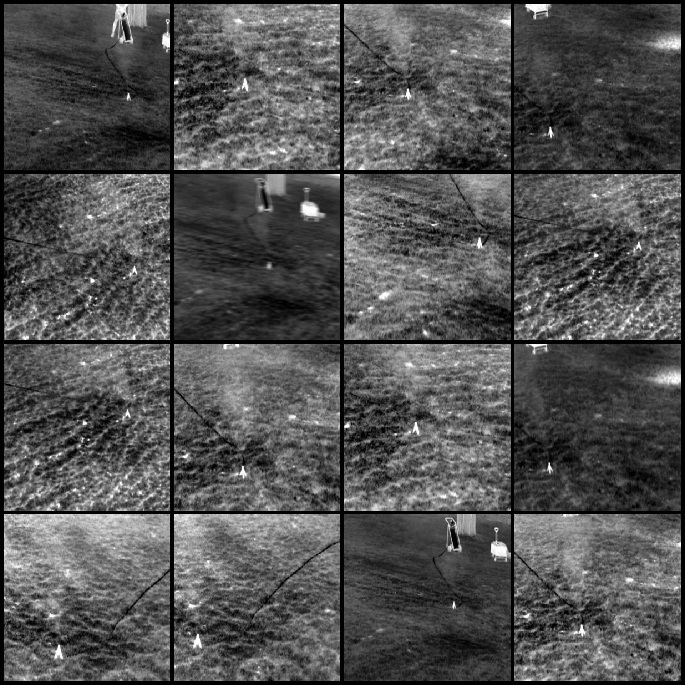
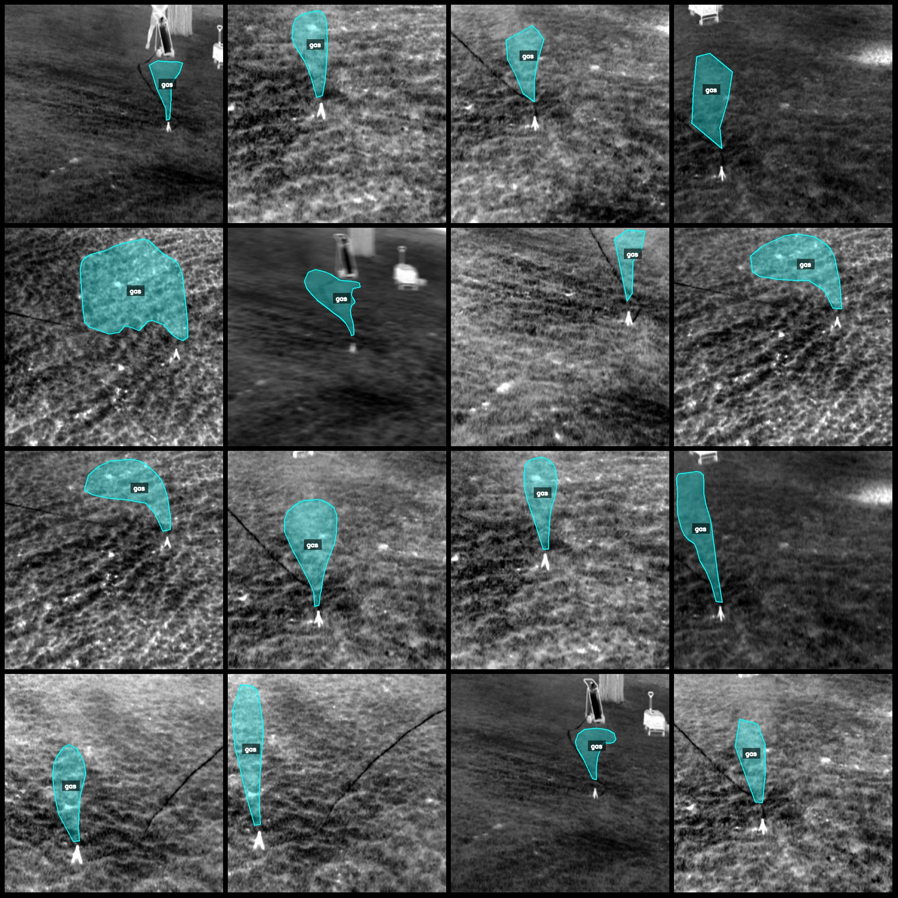
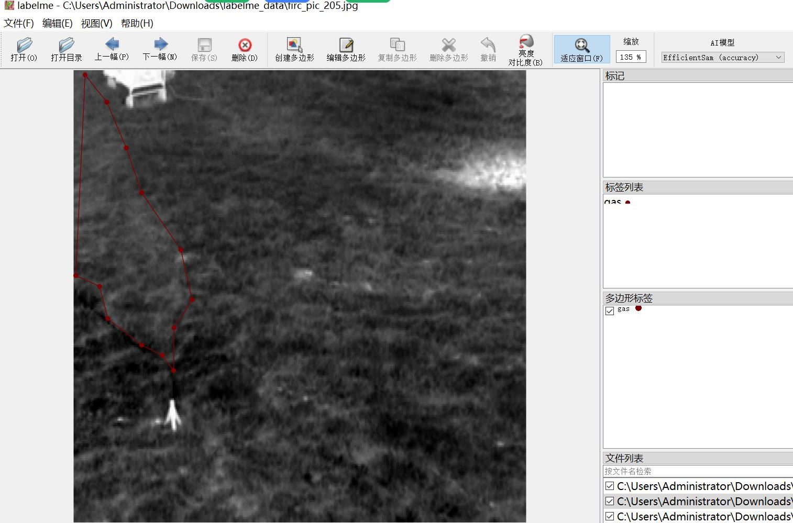

# Drone Perspective Methane Gas Leak Identification and Segmentation Dataset: LabelMe Format, 1094 Images in 1 Category

Dataset Format: LabelMe format (excluding mask files, only including JPG images and corresponding JSON files)
Number of Image Files: 1094
Number of Annotation Files: 1094
Number of Annotation Categories: 1
Annotation Category Name: ["gas"]
Number of Boxes per Category: 1094
Total Boxes: 1094
Annotation Tool Used: labelme = 5.5.0
Image Resolution: 640x640
Annotation Rules: Polygons are drawn around the categories
Important Note: The dataset can be edited using the LabelMe editor, and the JSON dataset needs to be converted into either Yolo or Coco format for instance segmentation or semantic segmentation
Special Notice: This dataset does not guarantee the accuracy of the trained models or weight files
Image Preview:
Annotation Example:
Randomly selected 16 images (with original):
Annotation drawing results:
LabelMe editing example image:

## Images

Here is a pay link on Stripe ( https://buy.stripe.com/3cs8yP7sY87d0vu9AB ). Please contact me lonlonago@foxmail.com after funding $89, and I will send you a complete data files , thank you!

